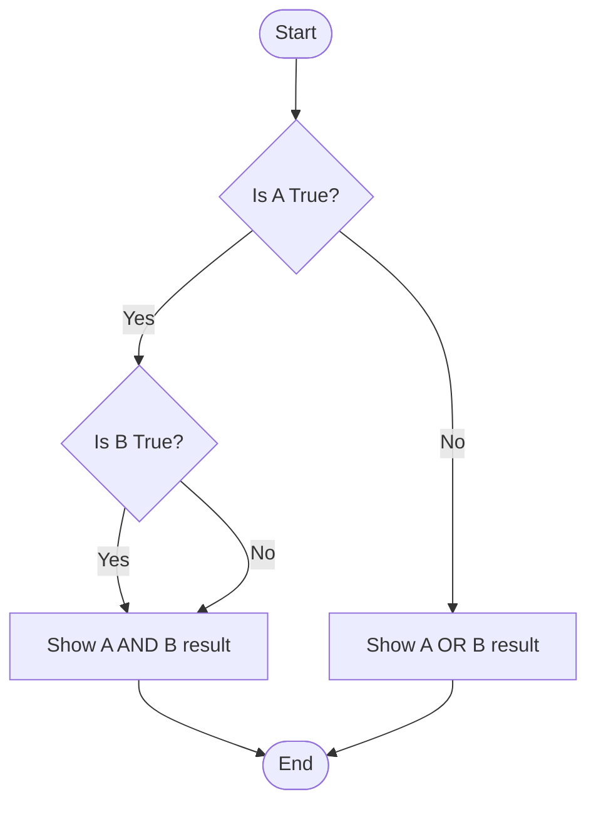

---

# 📘 Mathematical Thinking & Logic in Code

At its core, programming is about solving problems. Mathematical thinking provides the framework for this.  
Logic gates are the **building blocks** of all digital circuits and programming decisions.

---

## 🧠 Propositional Logic

Propositional logic involves reasoning with **simple statements** that are either `True` or `False`. In programming, we use this logic in `if` statements, loops, and condition checks.

### ✅ Common Logical Operators

| Operator | Name  | Description                          | Python Keyword |
|----------|-------|--------------------------------------|----------------|
| `and`    | AND   | True if **both** conditions are true | `and`          |
| `or`     | OR    | True if **at least one** is true     | `or`           |
| `not`    | NOT   | Reverses the truth value             | `not`          |
| `^`      | XOR   | True if **only one** is true         | bitwise XOR    |

### 🔍 Example in Python

```python
A = True
B = False

print("A and B:", A and B)   # False
print("A or B:", A or B)     # True
print("not A:", not A)       # False
print("A ^ B:", A ^ B)       # True
````

---

## 📊 Truth Tables

Truth tables help us **visualize the outcome** of logical operations for every possible input.

### ✅ AND Operation Truth Table

| A | B | A AND B |
| - | - | ------- |
| T | T | T       |
| T | F | F       |
| F | T | F       |
| F | F | F       |

### ✅ OR Operation Truth Table

| A | B | A OR B |
| - | - | ------ |
| T | T | T      |
| T | F | T      |
| F | T | T      |
| F | F | F      |

### ✅ NOT Operation Truth Table

| A | NOT A |
| - | ----- |
| T | F     |
| F | T     |

---

## 🔄 Logic Flow

### ✅ Decision Flowchart



---

## 🧪 Try It Yourself

Build your own **logic simulator** in Python:

```python
def logic_simulator(a, b):
    print("A AND B:", a and b)
    print("A OR B:", a or b)
    print("NOT A:", not a)
    print("A XOR B:", a ^ b)

# Test
logic_simulator(True, False)
```

---

## 💡 Real-Life Application Example

### Login Condition

```python
email_valid = True
password_correct = False

if email_valid and password_correct:
    print("✅ Login Successful")
else:
    print("❌ Login Failed")
```

---

## 👨‍🏫 Fun Fact

> **Boolean logic forms the foundation of AI decision-making and all digital circuits!**

---

## 🎮 Activity Prompt

Create a logic flow for a **Rock-Paper-Scissors** game using `if`, `and`, `or` conditions.
Can you use truth tables to validate all winning combinations?

---

## 📌 Summary

* Logic helps us write **clear, correct, and efficient** code.
* Truth tables help **debug conditions**.
* Boolean logic is everywhere — from **login systems to AI models**.

---

## 🧰 More Learning

* [Python Logical Operators – W3Schools](https://www.w3schools.com/python/python_operators.asp)
* [Digital Logic Simulator (TinkerCAD)](https://www.tinkercad.com/)
* [Mermaid Live Editor](https://mermaid.live/)

---
