---

# 📘 Set Theory in Code: Organizing Your Data

**Sets** are powerful mathematical tools for grouping unique items. In coding, they help with tasks like:
- Filtering data
- Removing duplicates
- Managing roles or access levels
- Comparing datasets

> 🤖 “Sets are like Venn diagrams... but way cooler in code!”

---

## 🔍 Core Concepts

- **Set:** A collection of **unique** unordered items.
- **Subset:** A set completely **contained within** another.
- **Union:** Combines items from **both sets**.
- **Intersection:** Items that are **common to both**.
- **Complement:** Items **not** in a specific set.

---

## 📊 Visual Explanation

### ✅ Venn Diagram Overview

```mermaid
%% Mermaid diagram for 3 sets A, B, C with intersection
graph TB
    subgraph Set A
        A1((Alice))
        A2((Bob))
    end

    subgraph Set B
        B1((Bob))
        B2((Charlie))
    end

    A1 --- B1
    A2 --- B1
    B2
````

This shows:

* Alice is in Set A only
* Bob is in **both**
* Charlie is in Set B only

---

## 🐍 Python Example: Managing User Roles

```python
admins = {"Alice", "Bob"}
editors = {"Bob", "Charlie"}

# Combine both groups
all_users = admins.union(editors)
print("All users:", all_users)  # {'Alice', 'Bob', 'Charlie'}

# Who is both admin and editor?
both_roles = admins.intersection(editors)
print("Users with both roles:", both_roles)  # {'Bob'}

# Who is only admin?
admin_only = admins.difference(editors)
print("Admins only:", admin_only)  # {'Alice'}
```

---

## 🧠 Code Breakdown

| Operation      | Python Code             | Output                        |
| -------------- | ----------------------- | ----------------------------- |
| Union          | `admins.union(editors)` | `{"Alice", "Bob", "Charlie"}` |
| Intersection   | `admins & editors`      | `{"Bob"}`                     |
| Difference     | `admins - editors`      | `{"Alice"}`                   |
| Symmetric Diff | `admins ^ editors`      | `{"Alice", "Charlie"}`        |

---

## 💡 Real-Life Uses

* Avoiding duplicate records in a contact list
* Checking permissions: who has access to what?
* Comparing two surveys: who answered both?

---

## 🔄 Flowchart: Set Comparison Logic

```mermaid
flowchart TD
    A[Start]
    B[Create Set A]
    C[Create Set B]
    D[Union A ∪ B]
    E[Intersection A ∩ B]
    F[Difference A - B]
    G[Print Results]

    A --> B --> C --> D --> E --> F --> G
```



---

## ✨ Try It Yourself

> 🧪 Challenge:
> Write a Python function that accepts two sets and prints:
>
> * All members
> * Members only in the first set
> * Members in both

---

## 🔚 Summary

* Sets help **organize, compare, and filter** data efficiently.
* Set operations like union, intersection, and difference are super common in coding.
* You’ll see sets used in permissions, tags, categories, surveys, etc.

---

## 🧰 More Resources

* [Python Sets Documentation](https://docs.python.org/3/library/stdtypes.html#set)
* [Interactive Set Calculator](https://www.symbolab.com/solver/set-calculator)


