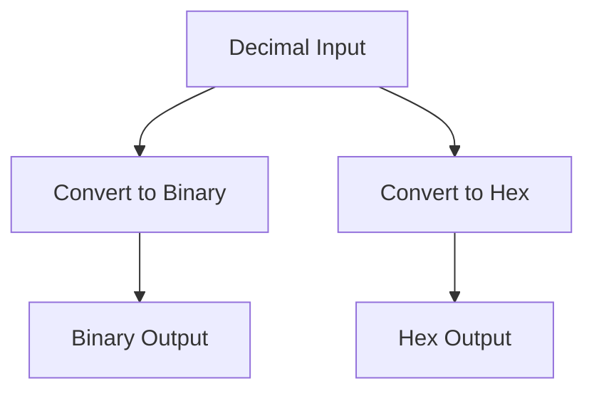

---

# 🔢 Unpacking Number Systems: Binary, Decimal, Hexadecimal

Computers speak in **binary** (0s and 1s), while humans use **decimal** (base 10). For more compact digital representations, we also use **hexadecimal** (base 16), which combines numbers and letters.

Understanding how to **convert between number systems** is essential for:
- Low-level programming
- Networking
- Memory representation
- Cryptography

---

## 🧠 Quick Definitions

| System       | Base | Digits Used               | Example                |
|--------------|------|----------------------------|------------------------|
| Binary       | 2    | 0, 1                      | `1011₂ = 11₁₀`        |
| Decimal      | 10   | 0–9                       | `25₁₀`                |
| Hexadecimal  | 16   | 0–9 and A–F (A=10…F=15)   | `FF₁₆ = 255₁₀`        |

---

## 📘 Concept Breakdown

### 1️⃣ Binary (Base 2)
- Used by all digital electronics and computers.
- Each digit is called a **bit**.
- Powers of 2:  
  `8  4  2  1`  
  Example: `1011`  
  → `1×8 + 0×4 + 1×2 + 1×1 = 11`

---

### 2️⃣ Decimal (Base 10)
- Our everyday number system.
- Digits: 0 to 9
- Example:  
  `25 = 2×10 + 5 = 25`

---

### 3️⃣ Hexadecimal (Base 16)
- Compact way to write binary (used in memory addresses, colors, etc).
- Digits: `0–9` and `A–F`  
  `A = 10`, `F = 15`  
  Example: `FF = 15×16 + 15 = 255`

---

## 🐍 Python Code: Convert Between Systems

```python
# Decimal to Binary, Hex
num = 255

print("Decimal:", num)
print("Binary:", bin(num))         # 0b11111111
print("Hexadecimal:", hex(num))   # 0xff

# Binary to Decimal
binary = "1011"
print("Binary to Decimal:", int(binary, 2))  # 11

# Hexadecimal to Decimal
hex_val = "FF"
print("Hex to Decimal:", int(hex_val, 16))  # 255
````

---

## 🎮 Fun Exercise: Binary Calculator

> Write a program that accepts two binary numbers and adds them.

```python
a = "1010"  # 10
b = "0101"  # 5

sum_decimal = int(a, 2) + int(b, 2)
sum_binary = bin(sum_decimal)

print("Sum in binary:", sum_binary)  # Output: 0b1111
```

---

## 🔄 Base Conversion Flow – Visual with Mermaid



---

## 🧠 Why This Matters

* Binary helps you understand how **data is stored** and manipulated.
* Hex is used in **low-level memory**, **color codes**, and **networking (e.g., IP packets)**.
* You'll encounter these everywhere in:

  * Embedded systems
  * Game dev
  * Systems programming
  * Frontend color design (`#FF5733` = RGB hex)

---

## 🧰 Further Reading

* [Binary to Decimal Converter – RapidTables](https://www.rapidtables.com/convert/number/binary-to-decimal.html)
* [Python Built-in Functions: `bin()`, `int()`, `hex()`](https://docs.python.org/3/library/functions.html)

---

## 🎯 Summary

| You Should Know\...     | Why It’s Useful                    |
| ----------------------- | ---------------------------------- |
| How to read binary      | Understand how computers think     |
| Convert between systems | Debug low-level code & configs     |
| Write Python for this   | Automate conversions in real-world |
