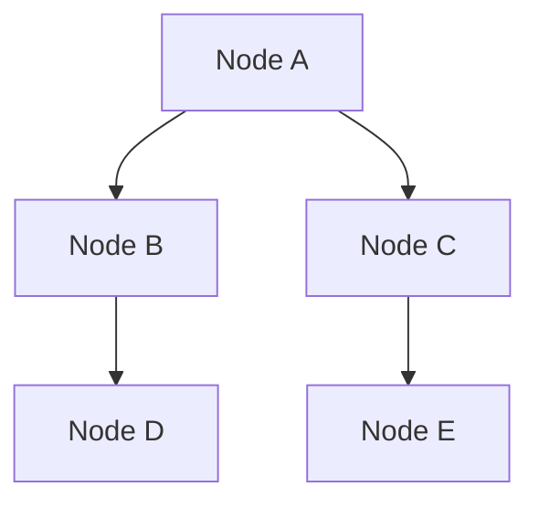

---

# 🔗 Functions & Graph Theory: Mapping Connections

**Functions** are like mini-programs inside your code. They take input(s), process them, and return an output.  
**Graph Theory** helps us represent and solve problems involving **connections and relationships** — just like maps, social networks, or routes.

---

## 🧠 Functions: The Code Recipes

```python
# Simple function
def greet(name):
    return f"Hello, {name}!"

print(greet("Alice"))  # Hello, Alice!
````

### ✅ What’s a Function?

* Think of a recipe:

  * **Inputs** = ingredients
  * **Function** = the cooking process
  * **Output** = finished dish!

---

## 🔁 Recursive Functions: Functions That Call Themselves

### Example: Factorial `n!`

```python
def factorial(n):
    if n == 0:
        return 1
    return n * factorial(n - 1)

print(factorial(5))  # 120
```

* Useful for:

  * Problems that can be broken into **smaller versions of themselves**.
  * E.g., Towers of Hanoi, Fibonacci, tree traversals.

---

## 🌐 Graph Theory: Modeling Relationships

> “Graphs connect the dots — quite literally!”

---

## 🔍 Graph Basics

| Concept  | Meaning                                  |
| -------- | ---------------------------------------- |
| **Node** | A point, object, or entity (e.g. person) |
| **Edge** | A connection or link between two nodes   |
| **Path** | A series of edges connecting nodes       |

---

### 🧠 Real-World Examples

* Social Networks: Friends → connections between users
* Road Maps: Cities (nodes), Roads (edges)
* File Dependencies: Which files rely on which others

---

## 🐍 Python Graph Example (Adjacency List)

```python
# Represent a graph as a dictionary
graph = {
    "A": ["B", "C"],
    "B": ["A", "D"],
    "C": ["A", "E"],
    "D": ["B"],
    "E": ["C"]
}

# Traversal: Depth-First Search (DFS)
def dfs(graph, start, visited=None):
    if visited is None:
        visited = set()
    visited.add(start)
    print(start, end=" ")
    for neighbor in graph[start]:
        if neighbor not in visited:
            dfs(graph, neighbor, visited)

dfs(graph, "A")  # Output: A B D C E
```

---

## 🔄 Mermaid Diagram: Graph Structure



---

## 🤝 Group Exercise Idea

> Build a small **graph of your classmates** based on shared hobbies or connections.

* Step 1: Each student = a node
* Step 2: Draw an edge if two students share a common interest
* Step 3: Use DFS or BFS to explore the network

---

## 🧠 Summary

| Concept             | Why It Matters                           |
| ------------------- | ---------------------------------------- |
| Functions           | Reusable logic, modular design           |
| Recursive Functions | Handle nested or repeating problems      |
| Graphs              | Model and solve relationship-based tasks |

---

## 📚 Resources

* [Python Graphs with NetworkX](https://networkx.org/)
* [Recursive Function Examples – Programiz](https://www.programiz.com/python-programming/recursion)
* [Introduction to Graph Theory – Brilliant](https://brilliant.org/wiki/graph-theory/)

