---

# ⚙️ Algorithms & Efficiency: Writing Faster Code

An **algorithm** is a set of clear steps to solve a problem. But great software isn't just about solving problems — it's about solving them **efficiently**.

> 🎮 **Efficient code = Happy users!**

---

## 🧼 Bubble Sort (Slow but Simple)

A basic sorting algorithm. It "bubbles" larger elements toward the end of the list by **repeatedly swapping adjacent elements** if they’re in the wrong order.

```python
# O(n²) Time Complexity
def bubble_sort(arr):
    n = len(arr)
    for i in range(n):
        for j in range(0, n - i - 1):
            if arr[j] > arr[j + 1]:
                arr[j], arr[j + 1] = arr[j + 1], arr[j]
````

### 🔍 Characteristics

* Easy to understand
* Very slow on large lists
* Best use: Teaching basic sorting logic

---

## 🔎 Binary Search (Fast and Efficient)

Searches a **sorted** list by repeatedly dividing it in half.

```python
# O(log n) Time Complexity
def binary_search(arr, target):
    left, right = 0, len(arr) - 1

    while left <= right:
        mid = (left + right) // 2
        if arr[mid] == target:
            return mid
        elif arr[mid] < target:
            left = mid + 1
        else:
            right = mid - 1

    return -1
```

### 🔍 Characteristics

* Much faster than linear search
* Only works on **sorted** data
* Reduces problem size by half each step

---

## 💡 Introduction to Big O Notation

**Big O Notation** measures the efficiency of an algorithm as the input size grows.

| Algorithm     | Time Complexity | Description                                       |
| ------------- | --------------- | ------------------------------------------------- |
| Bubble Sort   | O(n²)           | Slow for large `n` (double `n`, 4x time)          |
| Binary Search | O(log n)        | Very fast — only adds one extra step per doubling |

> Think of it like this:
>
> * “O(n²)” → gets **much worse** as input grows.
> * “O(log n)” → grows **very slowly**, even for large inputs.

---

## 🧠 Key Takeaways

| Algorithm         | When to Use                                 |
| ----------------- | ------------------------------------------- |
| **Bubble Sort**   | Learning basic sorting; small datasets only |
| **Binary Search** | Fast search in **sorted** data              |

---

## 🔄 Comparison Flow

```mermaid
flowchart TD
    Start[Input List]
    BSort["Bubble Sort O(n²)"]
    BSearch["Binary Search O(log n)"]

    Start --> BSort
    Start --> BSearch
    BSort --> Slow[Slower on large inputs]
    BSearch --> Fast[Fast search in sorted data]
```



---

## 💡 Bonus Activity

> Try sorting a list of 10 numbers using both **bubble sort** and **Python’s built-in sort**. Measure how long each takes using `time` module.

```python
import time

data = [9, 1, 8, 2, 7, 3, 6, 4, 5, 0]

start = time.time()
bubble_sort(data.copy())
print("Bubble Sort took:", time.time() - start)

start = time.time()
sorted(data)
print("Built-in sort took:", time.time() - start)
```

---

## 🎯 Summary

* Know the difference between **slow and fast algorithms**
* Use **Big O** to estimate how code scales
* **Start with readable code**, then optimize for performance later

---

## 📚 Further Reading

* [Visualgo: Interactive Algorithm Visualizer](https://visualgo.net/en/sorting)
* [Big O Notation Cheat Sheet](https://www.bigocheatsheet.com/)
* [Python `timeit` module](https://docs.python.org/3/library/timeit.html)

