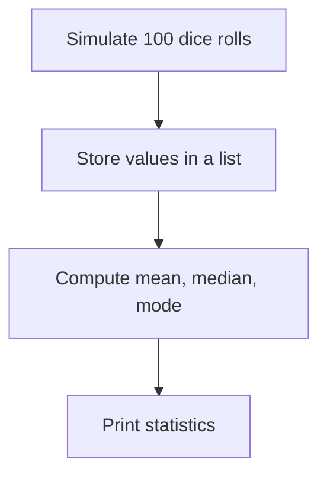

---

# 🎲 Probability & Statistics in Coding: Predicting the Unpredictable

**Probability** helps us understand uncertainty.  
**Statistics** helps us make sense of data.  

Together, they’re used in:
- Games
- Machine Learning
- A/B testing
- User behavior analysis

> 🧠 “Probability predicts the unpredictable!”

---

## 📘 Key Concepts

| Term       | Definition                                                                 |
|------------|-----------------------------------------------------------------------------|
| **Event**  | A specific outcome (e.g. rolling a 6)                                       |
| **Outcome**| All possible results (e.g. 1, 2, 3, 4, 5, 6)                                |
| **Mean**   | The average value                                                           |
| **Median** | The middle number in a sorted list                                          |
| **Mode**   | The most frequent value                                                     |
| **Variance** | A measure of how much the values spread from the average (mean)           |

---

## 🧠 Real-World Coding Use Cases

- 🎮 **Game development**: Dice rolls, shuffles, random events
- 🧪 **A/B testing**: User experiment comparisons
- 🧬 **AI & ML**: Predictions, probabilistic models
- 📊 **Survey analysis**: Understanding user patterns

---

## 🐍 Python Activity: Dice Simulation

```python
import random
import statistics

# Roll a 6-sided die 100 times
rolls = [random.randint(1, 6) for _ in range(100)]

# Basic statistics
mean = statistics.mean(rolls)
median = statistics.median(rolls)
mode = statistics.mode(rolls)
variance = statistics.variance(rolls)

print(f"Mean: {mean}")
print(f"Median: {median}")
print(f"Mode: {mode}")
print(f"Variance: {variance}")
````

### Sample Output

```
Mean: 3.49
Median: 3.5
Mode: 2
Variance: 2.2
```

---

## 📊 Data Distribution Flow



---

## 🧪 Challenge Extension

* Try with `1000` rolls — how does the distribution change?
* Change the number of sides to `20` (D20 dice).
* Visualize the frequency of each number using `collections.Counter`.

---

## 📚 Further Learning

* [Python `statistics` module](https://docs.python.org/3/library/statistics.html)
* [Khan Academy - Probability and Statistics](https://www.khanacademy.org/math/statistics-probability)
* [Dice Simulator Game with GUI – Beginner Projects](https://www.geeksforgeeks.org/python-dice-rolling-simulator/)

---

## 🎯 Summary

| What You Learned           | Why It’s Useful                              |
| -------------------------- | -------------------------------------------- |
| How to simulate randomness | For games, tests, models                     |
| How to compute basic stats | For data insights and decision-making        |
| Variance and spread        | Understand uncertainty and model reliability |

---
