---

# 🎮 Linear Algebra in Simple Terms: The Secret Sauce of Graphics

**Linear algebra** is a branch of math that deals with **vectors**, **matrices**, and **linear transformations**.  
It powers many fields — from **3D graphics** and **machine learning** to **robotics** and **game development**.

> 🎮 "Linear algebra is the secret sauce of game development!"

---

## 🔁 Vectors

Vectors are **quantities with both magnitude and direction**.  
Think of them as arrows that point from one location to another.

```python
# A 2D vector can be represented as:
v = [3, 4]
````

### 📌 Use Case

* Represent position, velocity, direction in physics simulations or graphics.

---

## 🧮 Matrices

A matrix is a **rectangular array of numbers**, often used to:

* Store data
* Transform vectors (e.g., rotate, scale, reflect)

```python
# 2x2 matrix
matrix = [
    [1, 2],
    [3, 4]
]
```

### 📌 Use Case

* In 2D/3D graphics, matrices apply transformations to game objects (rotate, move, stretch)

---

## ➕ Matrix Operations

| Operation          | What It Does                               |
| ------------------ | ------------------------------------------ |
| **Addition**       | Adds elements position by position         |
| **Subtraction**    | Subtracts elements one-by-one              |
| **Multiplication** | Combines rows and columns of two matrices  |
| **Inversion**      | Finds the "undo" transformation (optional) |

---

## 🔁 Visual Python Activity – Transform a Shape

```python
# Define a triangle using 2D coordinates (as columns)
import numpy as np

# Triangle points
triangle = np.array([
    [0, 1, 0.5],
    [0, 0, 1]
])

# Define a scaling matrix (2x size)
scale_matrix = np.array([
    [2, 0],
    [0, 2]
])

# Apply transformation
scaled_triangle = scale_matrix @ triangle

print("Original:\n", triangle)
print("Scaled:\n", scaled_triangle)
```

### 💡 Try It Yourself:

* Change the matrix to rotate or reflect the shape.
* Use `matplotlib` to visualize before and after.

---

## 🔄 Flowchart: Graphics Transformation Pipeline

```mermaid
flowchart TD
    Input[Define 2D Object]
    Matrix["Choose Matrix (Rotate, Scale, etc.)"]
    Multiply[Multiply Matrix × Object]
    Output[New Transformed Coordinates]

    Input --> Matrix --> Multiply --> Output
```



---

## 🧠 Summary

| Concept  | Use In Code                             |
| -------- | --------------------------------------- |
| Vector   | Position, direction, movement           |
| Matrix   | Transformations: scale, rotate, reflect |
| Multiply | Apply changes to the object in one step |

---

## 📚 Further Reading

* [Khan Academy – Linear Algebra](https://www.khanacademy.org/math/linear-algebra)
* [3Blue1Brown – Essence of Linear Algebra (YouTube)](https://www.youtube.com/watch?v=kjBOesZCoqc)
* [Numpy for Matrix Math](https://numpy.org/)

